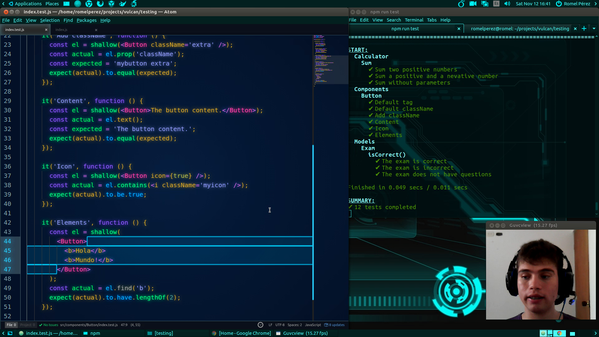

# web-testing

Una introducción general a software testing orientada a aplicaciones web con ejemplos de implementación.

## Partes

- [Parte 1: Fundamentos](./part1)
- [Parte 2: BDD con Mocha y Chai](./part2)
- [Parte 3: Tutorial de Karma](./part3)
- [Parte 4: Tutorial de Enzyme](./part4)
- [Parte 5: Integration testing de endpoints](./part5)

Ver **[lista de vídeos](https://www.youtube.com/playlist?list=PLAIjpj9Un1BBA1y_6VQuVLEuJY8rMavRV)** de cada parte.

## Herramientas de testeo

- [Mocha](http://mochajs.org)
- [Chai](http://chaijs.com)
- [Karma](http://karma-runner.github.io)
- [Enzyme](http://airbnb.io/enzyme)
- [Chai HTTP](http://chaijs.com/plugins/chai-http)
- [Chai Enzyme](https://github.com/producthunt/chai-enzyme)

## Herramientas de desarrollo

- [Node.js](http://nodejs.org)
- [Express](http://expressjs.com)
- [MongoDB](http://mongodb.org)
- [Mongoose](http://mongoosejs.com)
- [jQuery](http://jquery.com)
- [Backbone](http://backbonejs.org)
- [React](http://facebook.github.io/react)

## Herramientas extras

- [Babel](http://babeljs.io)
- [Webpack](http://webpack.github.io)
