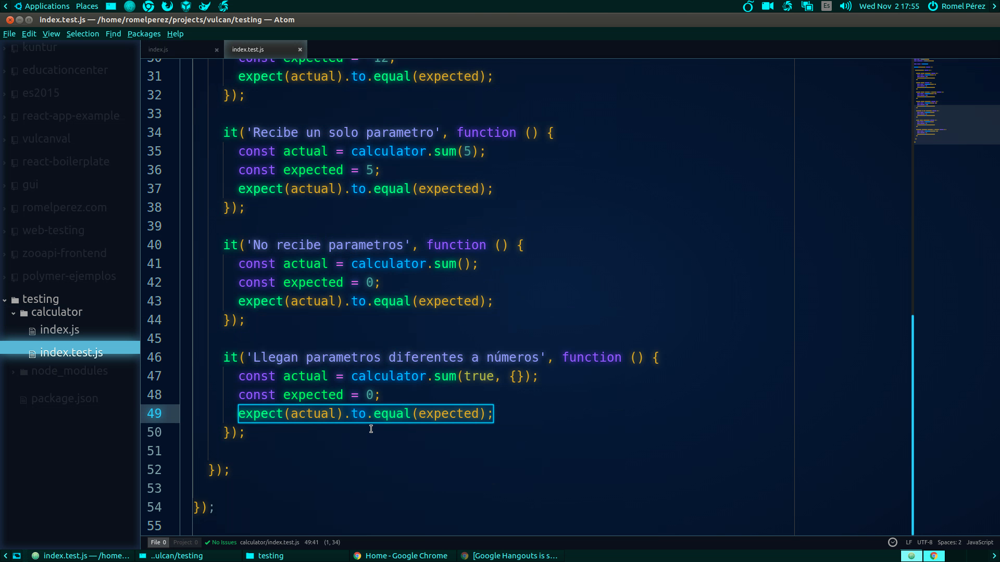

# Parte 1 - Fundamentos

Fundamentos de Software Testing enfocado a Web Apps con una inducción a Mocha y Chai.

Ver **[vídeo](https://www.youtube.com/watch?v=a6fLyPASdeg&index=1&list=PLAIjpj9Un1BBA1y_6VQuVLEuJY8rMavRV)** de esta parte.

## Recursos

- [Software Testing](https://en.wikipedia.org/wiki/Software_testing)
- [Coupling](https://en.wikipedia.org/wiki/Coupling_%28computer_programming%29)
- [(BDD) Behavior-Driven Development](https://en.wikipedia.org/wiki/Behavior-driven_development)
- [Introducing BDD](https://dannorth.net/introducing-bdd)
- [What's the difference between unit, functional, acceptance, and integration tests?](http://stackoverflow.com/questions/4904096)
- [Unit tests vs. Integration tests](https://www.youtube.com/watch?v=vqAaMVoKz1c)
- [5 Common Misconceptions About TDD & Unit Tests](https://medium.com/javascript-scene/5-common-misconceptions-about-tdd-unit-tests-863d5beb3ce9)
- [5 Questions Every Unit Test Must Answer](https://medium.com/javascript-scene/what-every-unit-test-needs-f6cd34d9836d)

[Volver al inicio >](../)
