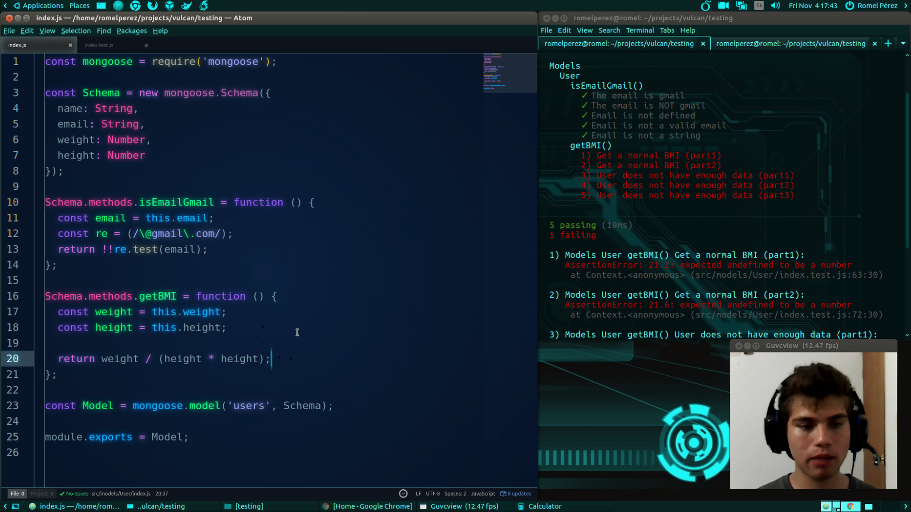

# Parte 2 - BDD con Mocha y Chai

Introducción a Behavior-Driven Development con Mocha y Chai en JavaScript.

Ver **[vídeo](https://www.youtube.com/watch?v=NM2ubmga5tA&list=PLAIjpj9Un1BBA1y_6VQuVLEuJY8rMavRV&index=2)** de esta parte.

## Recursos

- [(BDD) Behavior-Driven Development](https://en.wikipedia.org/wiki/Behavior-driven_development)
- [Introducing BDD](https://dannorth.net/introducing-bdd)
- [Introducción a las Promesas de ES6](http://www.desarrolloweb.com/articulos/introduccion-promesas-es6.html)
- [JavaScript Promises: an Introduction](https://developers.google.com/web/fundamentals/getting-started/primers/promises)

[Volver al inicio >](../)
