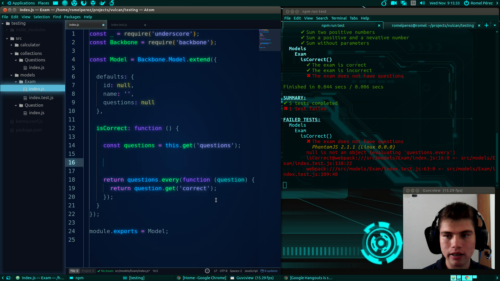

# Parte 3 - Tutorial de Karma

Tutorial de Unit Testing en browsers con el test runner Karma.

Ver **[vídeo](https://www.youtube.com/watch?v=ylFL_KvHn_g&index=3&list=PLAIjpj9Un1BBA1y_6VQuVLEuJY8rMavRV)** de esta parte.

## Recursos

- [Karma](http://karma-runner.github.io)
- [A Comprehensive Introduction to Webpack, the Module Bundler](http://www.theodo.fr/blog/2016/07/a-comprehensive-introduction-to-webpack-the-module-bundler)
- [Backbone](http://backbonejs.org)

[Volver al inicio >](../)
