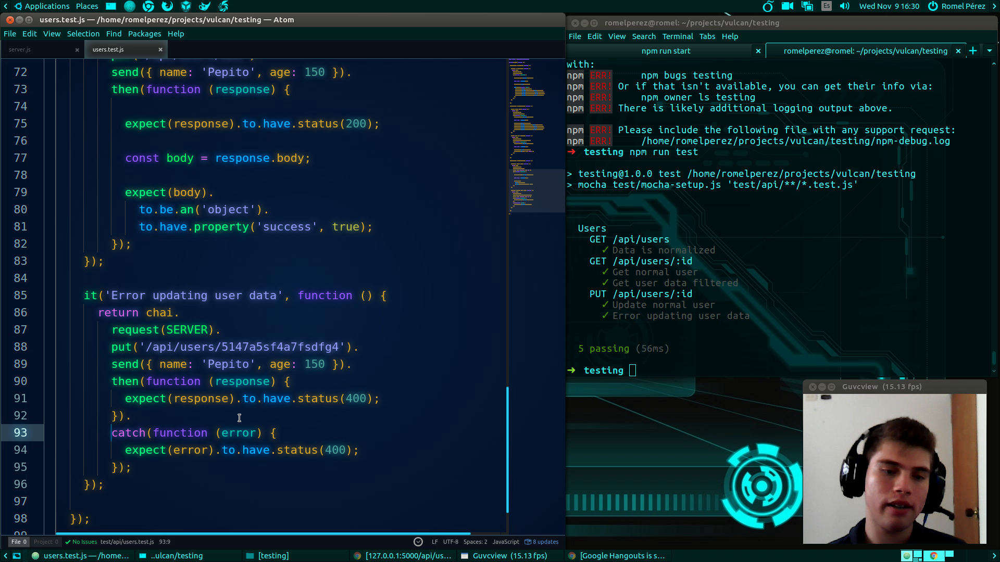

# Parte 5 - Integration testing de endpoints

Cómo crear tests de integración de endpoints de un servidor web con Mocha, Chai y Chai-http.

Ver **[vídeo](https://www.youtube.com/watch?v=pDlAEe10eIk&list=PLAIjpj9Un1BBA1y_6VQuVLEuJY8rMavRV&index=4)** de esta parte.

## Recursos

- [Mocha](http://mochajs.org)
- [Chai](http://chaijs.com)
- [Plugin: Chai HTTP](http://chaijs.com/plugins/chai-http)
- [Express](http://expressjs.com)

[Volver al inicio >](../)
